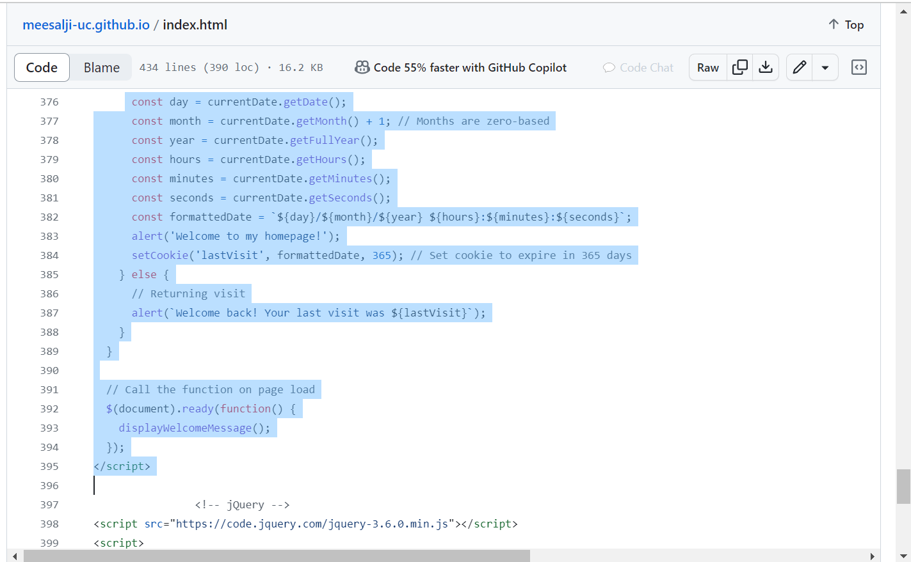

## waph-meesalji
# WAPH-Web APpLiCation Programming and Hacking

## Instructor: Dr. PHu Phung

## Student
*Name*: Jahnavi Meesala

*Email*: meesalji@mail.uc.edu

## Repository links:

[url](https://github.com/meesalji/meesalji-uc.github.io)

Here, is the link of my portfolio
[url](https://meesalji.github.io/meesalji-uc.github.io/)

# Individual Project 1 : Front-end Web Development with a Professional Profile Website on github.io cloud service

## Overview and Requriements

Our goal in this project is to improve our front-end web development skills by building a professional profile website and hosting it on the github.io cloud service. 
Each of the three requirements—general, non-technical, and technical—contributes to the final grade distribution of the project. 
Making a personal website showcasing our professional profile—which includes our résumé, contact details, education, experiences, and skills—is our primary duty. 
We also need to include a website that introduces the course "Web Application Programming and Hacking" and its associated projects.
We'll integrate page trackers for site traffic monitoring and use open-source CSS frameworks like Bootstrap to ensure a polished appearance and feel. 
Additionally, the technical specifications cover things like the usage of JavaScript, web API integration, and JavaScript functionality.

## General requirements
## Task 1:

Our job in this section of the project is to use GitHub's cloud service, github.io, to create and launch a personal website. 
The website will function as an online resume in the sense of a professional profile. Important facts like our name, our professional headshot photo, our contact information, and an overview of our past that includes our training, experiences, and qualifications should all be included.  
We hope to effectively introduce ourselves to potential employers through our website by showcasing our skills, experiences, and qualifications in an eye-catching and approachable way.
In this task I'm adding the screenshots of the code, resume and all the things I have created from the starting

Here, I'm adding my resume link
[url](https://meesalji.github.io/meesalji-uc.github.io/resume.html)

\

\

\

\

\

\

I'm adding my waph.html(view portfolio) link

[url](https://meesalji.github.io/meesalji-uc.github.io/waph.html)

## Task 2:

In an effort to improve the website's level of content, 
we've added a link to a fresh HTML page that introduces the "Web Application Programming and Hacking" course and the practical projects that go along with it. 
With its practical activities pertaining to web application development and hacking techniques, as well as its insights into the course curriculum, this supplement enhances the visitor's experience. 
Users can easily examine the course specifics and delve into the nuances of web development and security by embedding this link into the navigation bar. This deliberate inclusion strengthens our reputation and relevance in the tech community by highlighting our dedication to openness and thorough depiction of our professional endeavors.

\

\

## Non-technical requirements

## Task 3: 
  
 When developing our webpages, we used an open-source CSS template called Bootstrap. 
 With its abundance of pre-designed components and ability to streamline responsive design, Bootstrap makes it easier to create aesthetically pleasing and intuitive user interfaces. 
 Furthermore, we have included a page tracker tool on our webpage because we understand how important it is to monitor and evaluate visitor involvement. 
 Through the collection of insightful data on visitor behavior and engagement indicators, we are able to make well-informed judgments on the optimization of content and user experience. By using resources like Google Analytics

Below is the code i have used :

<!-- Google tag (gtag.js) -->

  
code screenshot\
\

output\
\

## Technical requirements

## Basic JavaScript code

## Task 4

Together with another open-source JavaScript framework/library, we've used jQuery to improve user experience and interactivity. 
Expanding on ideas presented in Lab 2, we've added a number of features, such as an analog and digital clock, the option to display or conceal email addresses, and additional functionality catered to our particular need.

<!-- Digital Clock -->

<!-- Analog Clock -->
<canvas id="analog-clock" width="150" height="150" style="background-color:#999"></canvas>

<!-- Show/Hide Email -->

Show my email

The following code snippet demonstrates how to integrate standard JavaScript features like showing and hiding email addresses and digital and analog clocks. 
These features improve our webpage's interaction and user engagement while showcasing our expertise with JavaScript and jQuery usage.

code\
\

\

output\

\
\

Our webpage's background color is dynamically changed by a jQuery feature that we've included. 
This feature improves the user experience overall by introducing a little personalization and interaction.
The jQuery function that listens for a button click event is implemented in this snippet of code. The chosen element's (color-element) background color dynamically changes to a randomly generated hexadecimal color when clicking the button.

<!-- jQuery Background Color Change -->

  <button id="color-button">Change Background Color</button>

screenshot\
\

\

## Two public Web APIs integration

## Task 5

The jokeAPI has been incorporated into our current HTML code. 
With the help of this integration, we can retrieve a fresh joke every minute from the Any category of the jokeAPI and show it on our page. 
We've developed a function that uses JavaScript to retrieve a random joke from the API, We've included JavaScript in our HTML code to retrieve data from the jokeAPI endpoint using the fetch API. 
We update the relevant portion of our webpage with the retrieved joke content after retrieving the joke data. 

code\
\

output\
\

## Task 6:

I have used this public API with graphics https://unsplash.com/oauth/applications/567692, I've included JavaScript routines that communicate with the Unsplash API into the current HTML code. 
These routines retrieve random images from the Unsplash library in response to their requests, which include parameters like image size and category, sent to the Unsplash server.
The JavaScript code instantly refreshes the image source on your webpage as soon as it gets a response from the Unsplash API. 
This increases the visual appeal of the website and maintains content freshness by displaying a fresh, randomly chosen image to visitors each time they load or refresh it.

code\
\

\

\

A. Welcome to my homepage

We'll develop JavaScript code that looks for the existence of a cookie containing the client's most recent visit in order to provide this capability. 
It's the user's first visit if the cookie is absent, in which case a "Welcome to my homepage!" message will appear. 
If not, the timestamp will be retrieved from the cookie and a "Welcome back! "This is the last time you visited <the date and time of last visit>."

Below is the screenshot of the code:
\

\

output of the code:
\

## Submission

Pandoc tool is used to generate the report in pdf format from the README.md file. The pdf is named as meesalji-waph-hackathons.pdf
